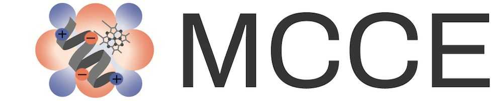

  

# Multi-Conformation Continuum Electrostatics

Welcome to the __MCCE4 tutorial__!  
This guide walks you through calculating electrostatic potentials from a biomolecular structure.

🚀 __Get Started Now:__ [__MCCE4 GitHub__](https://github.com/GunnerLab/MCCE4-Alpha)  
📖 __Full documentation:__ [__MCCE4 Tutorial & Guide Website__](https://gunnerlab.github.io/mcce4_tutorial/)

---

## __Quick Introduction__

__MCCE4__ is a physics-based computational biophysics program for predicting:

- __pKₐ values__
- __Protonation states__
- __Electrostatic properties__ of biomolecules

In this program, protein side chain motions are simulated explicitly while the dielectric effect of solvent and bulk protein material is modeled by continuum electrostatics.

---

## __Documentation Overview__

Comprehensive documentation covering:
- Installation
- Guide: Detailed explanations of all settings
- Example Projects

---

Copyright (C) 2024 GunnerLab
This software is distributed under the terms the terms of the MIT licence
